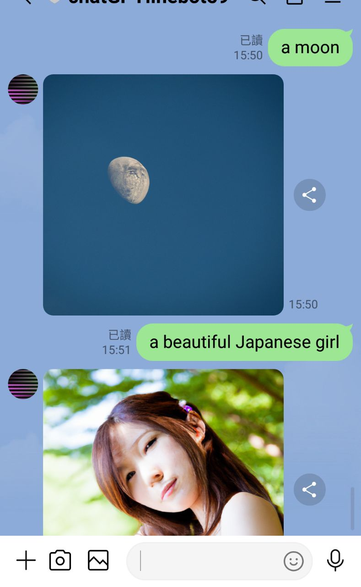
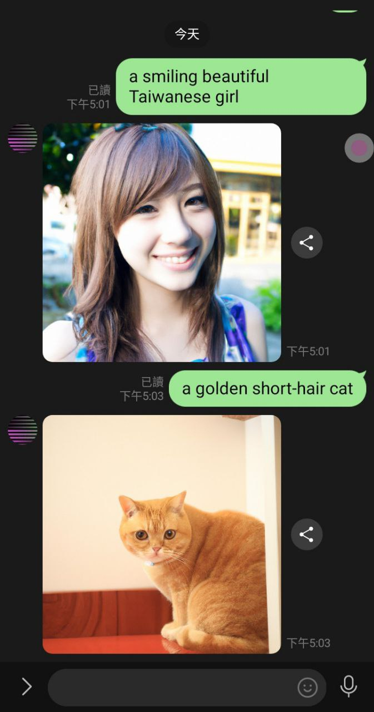
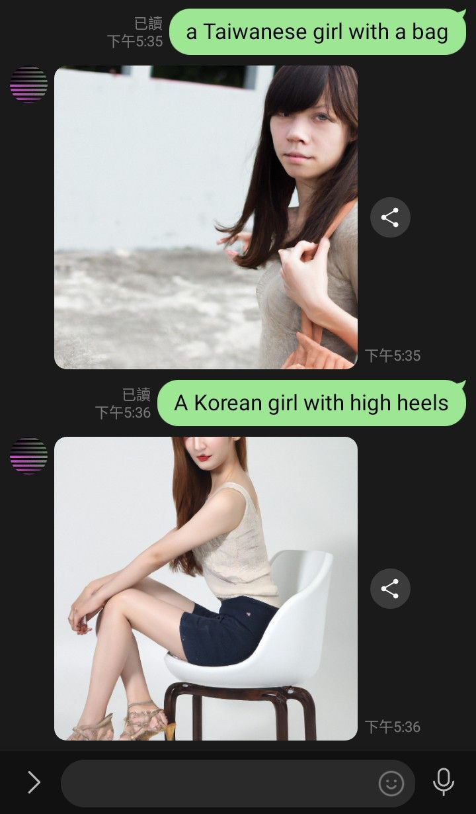
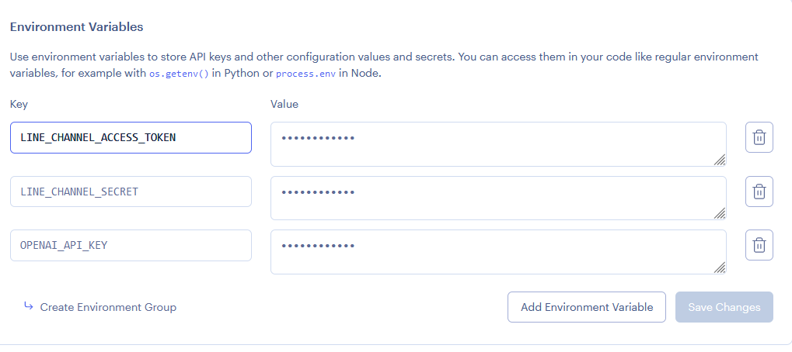

# Django-DALLE-linebot-Render
# 一個使用Django框架和圖像生成AI DALLE，創造一個linebot的專案，快速建置於平台Render。
# 源於pyfbsdk59/Django-DALLE-linebot-Render https://github.com/pyfbsdk59/Django-DALLE-linebot-Render
# 修改更新至可使用

  

  

  

#### 1. 本專案屬在Render上，在Render網站中，選擇新增「Web Services」，可用github帳號匯入此專案，可先fork到自己的帳號，然後設定自己的名稱和選擇免費free方案。記得按下方「Advanced」，設定環境變數。

  

  

#### 2. 必須在Render的Environment Variables設定3個環境變數，分別是OPENAI_API_KEY和LINE_CHANNEL_SECRET和LINE_CHANNEL_ACCESS_TOKEN。然後開始部屬，可能要花上一些時間。成功後複製自己的URL貼到line developer的Webhook URL來做設定和測試。例如：

https://xxx.onrender.com/

  

### 3. 注意Start Command要改為export PATH=$PATH:/usr/local/python3/bin && pip install gunicorn && gunicorn config.wsgi:application來啟動。

